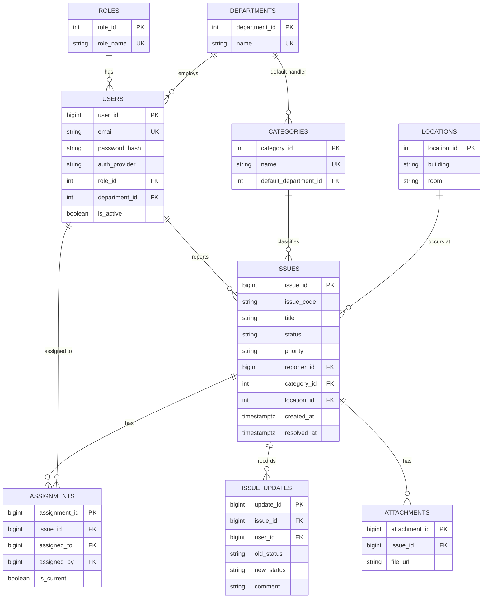
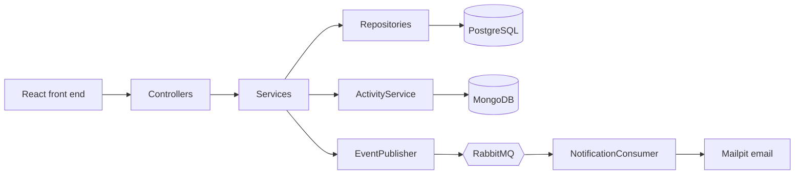

# FixIt Campus: Campus Issue Tracker

Web Technology project, 2026-2027. A web application where students and staff report campus facility problems, maintenance staff resolve them, and management monitors progress.

## 1. Requirements

### Problem statement
Students and staff report facility problems (broken lights, leaking taps, faulty projectors, Wi-Fi outages) through WhatsApp, phone calls, and paper notes. Reports get lost or duplicated, nobody knows who is responsible, reporters get no feedback, and management has no data on response times or recurring problems.

### Target users
| Role | Can do |
|---|---|
| Student / Staff | Report issues, track their own issues, confirm or reopen a resolution |
| Maintenance staff | See assigned issues, update status, add progress notes |
| Administrator | See all issues, assign them, manage users and roles |
| Management | Monitor statistics and reports |

### Objectives
1. Provide one platform for reporting and tracking campus issues.
2. Assign each issue to responsible staff and keep an assignment history.
3. Let reporters follow progress and receive notifications.
4. Record who did what and when, for accountability.
5. Restrict each action to the right role (RBAC).
6. Publish events through RabbitMQ for notifications.

### Scope
**In scope:** registration and login, role-based access, issue reporting and status workflow, assignment, activity feed and comments, event-driven notifications, responsive web interface.
**Out of scope:** physical repairs, spare-part inventory, IoT sensors, payments, native mobile apps.

### Status workflow
`SUBMITTED -> ASSIGNED -> IN_PROGRESS -> RESOLVED -> CLOSED`, and `RESOLVED -> REOPENED -> IN_PROGRESS`.

### Functional requirements (summary)
Login and roles; submit issues with category, location and description; assign issues; update status; view own issues; notifications on important events; admin management of users and roles; timestamps on all activity; RBAC on every protected endpoint; events published to RabbitMQ.

### Quality attributes
| Attribute | Target |
|---|---|
| Usability | A reporter can submit an issue in under 2 minutes without training; layout works from 360 px to desktop width |
| Performance | Issue lists answer in under 500 ms on 5,000 rows (verified with `EXPLAIN ANALYZE`, see section 6) |
| Reliability | A submitted report is stored in PostgreSQL before any notification is attempted; a failed notification never loses the report |
| Security | BCrypt password hashing, signed JWT tokens, RBAC on endpoints, JSON errors without stack traces |

### User stories and acceptance criteria
**US1. Report an issue (student or staff).** As a student I want to report a facility problem so the right people can fix it.
- Given I am logged in, when I submit a title, category, location and description, then the issue is saved with status SUBMITTED, a unique code (for example ISS-00125) and a creation time.
- I can see the issue in my list afterwards.
- Missing required fields are rejected with a clear message.

**US2. Handle an assigned issue (maintenance staff).** As a maintenance worker I want to update the issues assigned to me so reporters know what is happening.
- I only see issues assigned to me.
- I can move the status forward and every change is recorded with time and author.
- The reporter can see the new status.

**US3. Assign and monitor (administrator).** As an administrator I want to assign issues and watch their progress.
- I can see all submitted issues and assign each to a staff member.
- The assignment is stored with who assigned it and when; reassignment keeps the history.
- A user without the administrator role gets a 403 when calling admin endpoints.

## 2. Domain and data model

### Domain concepts
- **Actors:** reporter (student or staff), maintenance staff, administrator, management, notification service.
- **Processes:** report, triage and assign, resolve, confirm or reopen, notify, audit.
- **Data objects:** issue, assignment, issue update, comment and activity event, attachment, reference data (categories, locations, departments, roles).

### Entity relationship diagram (PostgreSQL)

### Technology schema
Schema is created by Flyway migrations in `backend/src/main/resources/db/migration`:
- `V1__create_users_roles_departments.sql`: roles, departments, users, seed roles and departments.
- `V2__create_issue_tables.sql`: categories, locations, issues, assignments, issue_updates, attachments, indexes, seed categories and locations.

Key constraints: `CHECK` on status, priority and auth provider; unique email; unique location per building, floor and room; a partial unique index allowing only one current assignment per issue; `CHECK` that a LOCAL user has a password hash.
Indexes: `issues(reporter_id, created_at DESC)`, `issues(status, created_at DESC)`, `issues(category_id, location_id)`, `issues(created_at)`, partial indexes on current assignments.

### Why two databases
| Database | Stores | Reason |
|---|---|---|
| PostgreSQL | Users, roles, issues, assignments, status history, reference data | Relationships, integrity constraints, transactions, reporting joins |
| MongoDB | Issue activity feed and comments (`ActivityEvent` documents) | Append-mostly, grows quickly, flexible shape per event type |

MongoDB documents reference PostgreSQL IDs. PostgreSQL is the source of truth, and issues are never deleted.

## 3. Front-end prototype
`frontend/index.html` is a responsive React prototype using sample data. Open it in a browser. It has a login screen, my issues, report issue, issue detail with timeline and role-based actions, and an administrator dashboard. On narrow screens the side navigation becomes a bottom bar and list rows stack. Use the "Preview as" options on the login screen to see the three roles.

## 4. Backend architecture
Layered monolith (Spring Boot 4, Java 21):

Packages under `backend/src/main/java/issuetracker`: `controller`, `service`, `repository`, `model`, `dto`, `security`, `exception`, `messaging`, `document`.
Controllers: `AuthController` (register, login), `MeController` (current user), `IssueController` (issues, status workflow, comments, activity), `AdminController` (user and role management).

## 5. Security and RBAC
- Passwords are hashed with BCrypt.
- Login returns a signed JWT; protected endpoints require it (`SecurityConfig`, `JwtService`).
- RBAC: user and role management is limited to administrators, and issue visibility and actions depend on the caller's role.
- Errors are returned as JSON without stack traces (`ApiExceptionHandler`).

## 6. Messaging and performance
- Issue events are published to RabbitMQ (`EventPublisher`, `RabbitConfig`) and consumed by `NotificationConsumer`, which sends email through Mailpit (a local test mail server).
- Performance check: with 5,000 generated issues, the "newest issues with a given status" query ran in 0.25 ms using a backward scan of `idx_issues_created_at`, because the planner found it cheaper than sorting. Composite indexes on `(status, created_at)` and `(reporter_id, created_at)` serve rarer values.

## 7. Implementation status
| Brief item | Status |
|---|---|
| 1. Requirements and user stories | Done (this document) |
| 2. Domain and data model | Done |
| 3. Responsive front end | Prototype with sample data; not yet connected to the API |
| 4. Backend architecture | Done (layered Spring Boot API) |
| 5. PostgreSQL and MongoDB | Done |
| 6. Authentication, OAuth2, performance | JWT login and BCrypt done; OAuth2 social login (Google) not implemented; index-based performance evidence only |
| 7. RabbitMQ | Events and email notifications done; SMS not implemented |
| 8. RBAC | Done |
| 9. Git and pull request | Feature branches merged by pull request |
| Bonus: DevOps | Docker Compose for PostgreSQL, MongoDB, RabbitMQ and Mailpit |

### Known gaps and next steps
1. Connect the React screens to the REST API.
2. Add OAuth2 Google login.
3. Add SMS delivery as a second RabbitMQ consumer.
4. Add file uploads for attachments (the table exists, the endpoint does not).
5. Add pagination and automated tests.
